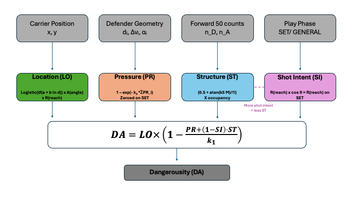
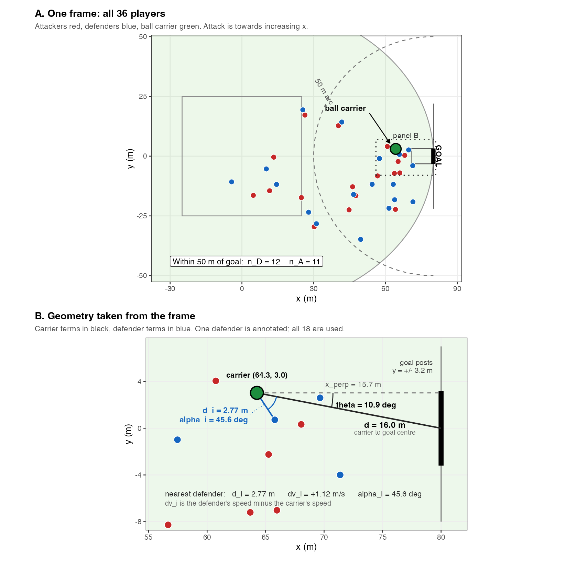
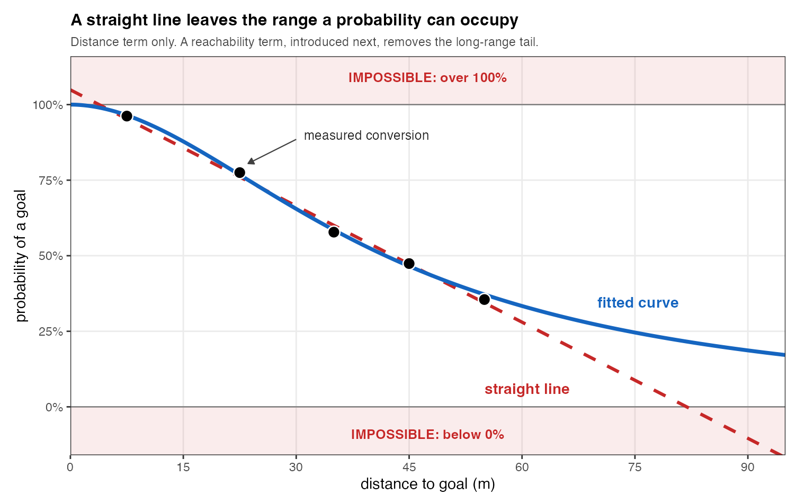
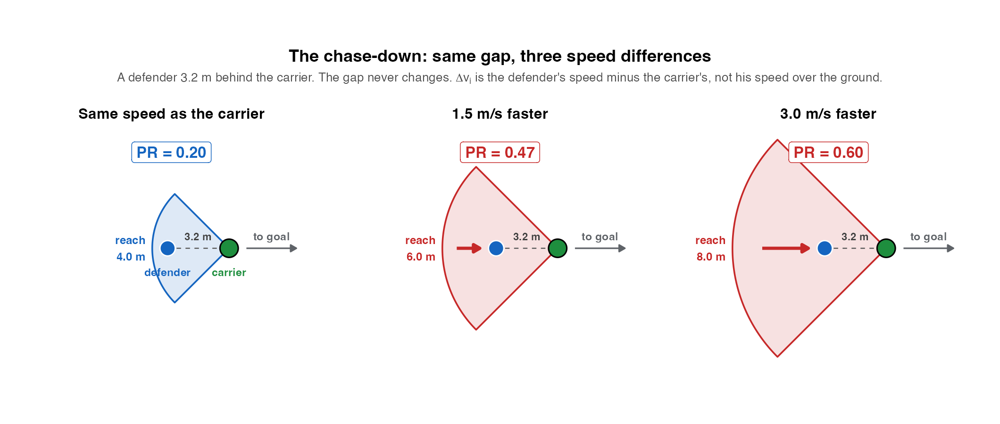
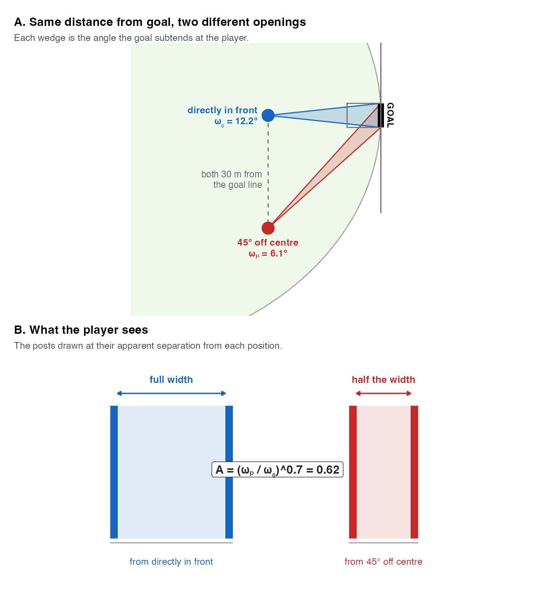
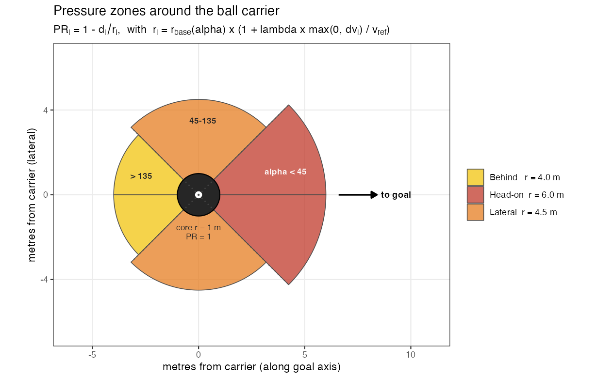

# AFL Dangerousity: measuring attacking threat from player tracking

An inside 50 entry can produce a mark 20 metres directly in front of goal or a hurried kick into a three-on-one contest. Both count as one entry, but the attacking opportunities are very different.

**Dangerousity asks how threatening the current attacking position is, before a shot or disposal occurs.** I designed an AFL-specific formula that combines the ball carrier's location, nearby defensive pressure, the balance of players inside the forward 50 and the likelihood that the position allows a shot.

I translated those ideas into an R model that returns both the final dangerousity score and its component terms. This repository presents my model design, implementation, explanatory figures and completed report. The project brings together football reasoning, mathematical model design, geometric visualisation and parameter sensitivity analysis.

## Why measure dangerousity?

I wanted to describe the quality of attacking situations more clearly than event counts alone. A measure of spatial threat could help analysts:

- Compare attacking positions that produce the same recorded event.
- Explain how defensive pressure and forward-line structure reduce an opportunity.
- Identify frames for tactical review and communicate why one position is more threatening than another.

With continuous tracking and recorded outcomes, this approach could be extended to changes in threat across a passage of play. My current implementation scores individual frozen frames; I interpret its output as a proposed relative threat score, with the limitations outlined below.

## The formula

$$
DA = LO \times \left(1 - \frac{PR + (1-SI)\,ST}{k_1}\right)
$$

| Term | What I measure | Role in the model |
| --- | --- | --- |
| **Location (LO)** | Distance to goal, the visible opening between the posts and whether a kick can reach goal. | Establishes the position's scoring potential and the ceiling for dangerousity. |
| **Pressure (PR)** | Each defender's distance and direction relative to the carrier, adjusted by the difference in their speeds. | Discounts location for nearby defensive interference; switched off for set plays. |
| **Structure (ST)** | Defender-versus-attacker numbers inside the forward 50, excluding the ball carrier, and the number of defenders present. | Represents the difficulty of moving the ball through a defended forward line. |
| **Shot Intent (SI)** | Reachability and, in general play, the carrier's angle to goal. | Gates the structural penalty: a position that strongly resembles a shot receives less of that penalty. |

I use `k₁ = 2.5`, named `k_cap` in the R code, to bound the combined discount. Location is multiplied by the remaining opportunity after pressure and structure are accounted for. This keeps the final score at or below its location value. When shot intent approaches one, the structural term contributes very little to the discount.

## From a tracking frame to a score

The model represents a frame with 18 attackers and 18 defenders, with one ball carrier. It derives the quantities needed for Location, Pressure, Structure and Shot Intent from the arrangement of players and the phase of play.

*This example illustrates the calculations: the model derives distance and angle to goal, defender-to-carrier geometry and player counts inside the forward 50. One defender is annotated for clarity; all 18 contribute to the pressure calculation.*

My implementation follows four steps:

1. Derive the carrier's distance and angle to goal and each defender's position relative to the carrier.
2. Calculate `LO`, `PR`, `ST` and `SI`, with different treatment of set plays and general play.
3. Combine the terms into `DA` for each frame.
4. Rank all plays by dangerousity, retaining the components so the score can be explained.

## Design decisions illustrated

### A bounded distance curve

I use published set-shot conversion rates to construct the distance component of Location. A logistic curve using log distance stays between zero and one; a straight-line fit can return impossible probabilities at short and long distances. Angle and kick reachability are then applied as separate adjustments.

*This figure shows the distance component alone. The final location term also includes an angle penalty and a reachability term that reduces the long-range tail.*

### Pressure changes with relative speed

Defender reach depends on position: 6.0 m head-on, 4.5 m laterally and 4.0 m behind the carrier. A positive defender-minus-carrier speed difference expands that reach. Pressure contributions from all defenders are combined using a saturating function, so additional defenders have diminishing influence.

*The gap stays fixed while the assumed speed difference changes. The labels show the individual defender contribution. Recorded speeds have no direction, so this adjustment is a proxy for pursuit, not a measured closing velocity.*

More geometry: goal opening and pressure zones

### The angle of opportunity

*Comparing the visible goal opening with a central reference at the same distance from the goal line isolates the off-centre penalty.*

### Defender pressure zones

*The pressure-zone diagram explains one part of the model. The complete score also depends on location, forward-line structure and shot intent.*

## Implementation and sensitivity analysis

The main scoring script uses base R and returns an inspectable table containing `DA`, all four component terms, distance and angle to goal, play phase and the number of defenders inside the forward 50.

My exploratory script also includes comparisons with distance-only and location-only rankings. It varies six parameters individually and compares rankings using Spearman correlation and top-10 overlap. These checks examine the model's dependence on its design choices; they do not establish predictive accuracy against goal outcomes.

| File | Purpose |
| --- | --- |
| [dangerousity_analysis.R](dangerousity_analysis.R) | Final scoring function, parameters and ranking workflow. |
| [Working/explore_dangerousity.R](Working/explore_dangerousity.R) | Geometry exploration, component calculations, baseline comparisons and sensitivity analysis. |
| [Working/design_dangerousity_model.R](Working/design_dangerousity_model.R) | Derivation notes, design reasoning and earlier model choices. |
| [reports/dangerousity_report.pdf](reports/dangerousity_report.pdf) | Complete report with equations, parameter choices, sources and limitations. |
| [Figures/dangerousity_diagrams.pptx](Figures/dangerousity_diagrams.pptx) | Supporting explanatory diagrams. |

## Code and dependencies

The main implementation is in `dangerousity_analysis.R`, with the formula expressed in the `danger()` function and the parameters grouped by component. Its output table, `DA_output`, presents dangerousity and its component terms in descending score order.

The scoring implementation uses base R. The exploratory scripts use `dplyr`, `ggplot2` and `ggforce`. See [DEPENDENCIES.md](DEPENDENCIES.md).

## Interpretation and limitations

- **No outcome validation:** the final score is not a calibrated goal probability or a validated expected-possession-value model.
- **Mixed parameter evidence:** the distance curve draws on published conversion rates; other choices rely on football reasoning and geometric assumptions.
- **Speed without direction:** a faster defender moving away from the carrier can receive the same reach adjustment as one pursuing the carrier.
- **Single-frame scope:** possession history, contest state, player skill, weather, score and time remaining are outside the current implementation.
- **Goal-focused location:** behinds and the value of moving the ball to a better-positioned teammate are not explicitly modelled.

## Report and sources

**[Read the complete dangerousity report (PDF)](reports/dangerousity_report.pdf)** for the full derivation and references. The report folder contains the PDF version for portfolio review.

I adapted the dangerousity concept from [Link, Lang and Seidenschwarz (2016)](https://doi.org/10.1371/journal.pone.0168768) to AFL geometry and play phases. [Anderson et al. (2018)](https://doi.org/10.1177/0031512518781265) provides the set-shot conversion rates used for the distance component. The report documents the remaining sources and assumptions.

Additional publication notes are recorded in [REVIEW_BEFORE_PUBLIC.md](REVIEW_BEFORE_PUBLIC.md) and [RIGHTS.md](RIGHTS.md).
